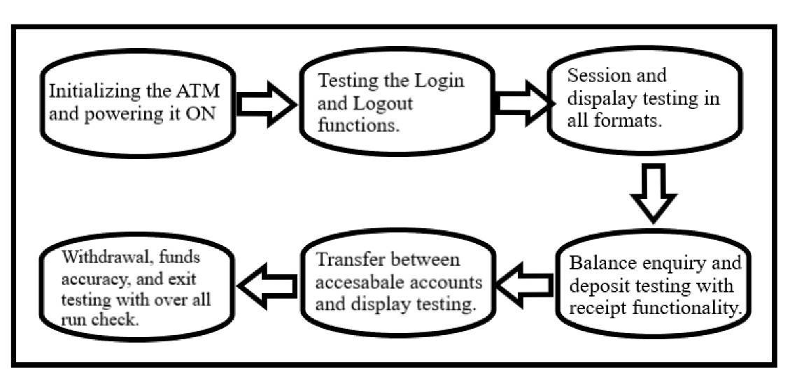

>   **ASSIGNMENT -1**

>   **LAB. REPORT – INTRODUCTION TO TESTING AND DEFECT TRACKING**

>   **GROUP - 19**

| Group \#:                         |19 |
|-----------------------------------|---|
|Aishwarya Satyasai Dantam          |30136178|
|Ratna Sai Pravallika Kottam Setty  |30137702|
|Suraj Salver                       |30124245|
|Umesh Kumar Ravi                   |30111560|

**Table of Contents**
- Introduction
- [Link of demo video](https://drive.google.com/file/d/1HwvsgE3w5fpok701BXBJm-5mrpl6lD3h/view?usp=sharing)
- What did we know about exploratory and manual testing before this lab
- High-level description of the exploratory testing plan
- Comparison of exploratory and manual functional testing
- Notes and discussion of the peer reviews of defect reports
- How was the teamwork and any lessons learned from your teamwork in this lab?
- Difficulties encountered, challenges overcome, and lessons learned
- Comments/feedback on the lab and lab document itself

# Introduction

In this lab work, we had a chance to get hands-on experience of how software is tested in the industry. 
This laboratory has made us understand the basic core of the software testing plan on how a system under test can 
be tested and bugs can be reported effectively. Initially, the first stage gave us a chance to understand the 
working of the ATM very precisely and the familiarization part of the support documentation has clearly outlined 
how the ATM system under test carries out transactions and functions related to the cards mentioned. And the 
high-level requirements description and the flow chart of the ATM module allowed us to have a minute and detailed 
understanding of the workflow which we eventually used to compare the functionalities and point out the bugs in 
the system when the system behavior contradicts the described flow. Overall, the documentation provided us with 
enough information for us to get an idea of the assignment in the first stage.  

Coming to the testing part, in this lab, we had performed three levels of testing of the ATM application. 
We had been given 2 versions of the ATM in which version 1.0 has a lot of bugs to fix and version 1.1 has some of 
these bugs fixed partially. So, we initially developed a brief test plan with a proper designated testing flow for 
carrying out the exploratory testing on the ATM 1.0. And then, we noted all the bugs found in the system and made 
a detailed report in the backlog profile after carrying out the testing as per the developed plan in pairs. Now we
had the chance to discuss in here amongst the two pairs and found the common bugs and new bugs found and listed 
them accordingly.  

Next, we now fall back on manual testing. In this we all four members worked together and the test cases given 
in the manual were thoroughly tested one at a time and parallelly we also compared the bugs we found in the earlier 
stage and if it matched, we kept it noted for our reference and the new ones were registered in the backlog file 
successfully. In this process, we observed that most of the bugs encountered were detected in the initial stage of
the testing (Exploratory testing) and this tells us that the plan we plotted to find maximum bugs to our capabilities 
has worked effectively and was able to fetch a good number of bugs when compared with the test cases mentioned. 
But from an overall perspective, we could find roughly 3 additional bugs when we performed the manual testing and 
this gave us clear-cut evidence of the exploratory testing plan's success and the number of rigorous tests, we 
performed using the plan we designed. Overall, this manual testing has provided us with all the necessary bugs 
which existed out of our site and best of our knowledge. 

Lastly, regression testing seemed to be an extended version of the whole testing process for the previous test 
cases noted with version 1.0. In this, the whole idea was to fetch as many as bugs possible in version 1.1 which 
we found out in our previous version 1.0 along with the few new bugs. We were able to collect the final bug report 
for version 1.1 as well and the details about the whole bugs in both versions are explained briefly going further. 

# Link of demo video 

[Group explanation video](https://drive.google.com/file/d/1HwvsgE3w5fpok701BXBJm-5mrpl6lD3h/view?usp=sharing)

# What did we know about exploratory and manual testing before this lab
 
To talk about our prior information on exploratory and manual functional testing, we considered testing has
a unique and one-directional approach in which the software gets tested accordingly with some predefined test cases.
And also presumed that there is no particular testers plan for each of the software test flows which would give 
freedom to the person who is testing it, to get more and more bugs in a non-manual format. The overall perspective
of the testing has changed in our opinion with this lab.  

To specifically talk about the exploratory testing, our group members had different perspectives in regards 
to this testing methodology, one set of the team considered the exploratory testing to be more of an unorganized and 
random method of testing the software and the other set considered it to be as a core testing of the software with unknown 
process flow. But the common point was that all of us didn't consider having a properly planned process flow design 
to approach the software under test. But in the end, the team has landed on a common understanding with some great 
teamwork, information exchange capabilities and clear-cut hands-on information about the process which greatly 
helped us to understand the concept thoroughly. 

Coming to manual testing, the information about this for all of us was more or less close to the actual process
of what manual testing is all about. We thought it was a process of testing the software with a set of guidelines and 
guidelines support document of the software which we followed accordingly to fetch maximum bugs out of the test cases. 
But altogether we had an idea of what we were about to do practically but the actualness of the prior knowledge we had 
varied a bit from the information provided. A quick skim and understanding of the document has given us a clear idea 
about both the procedures without any difficulties.

# High-level description of the exploratory testing plan

The exploratory high-level plan we developed is based on the above-mentioned block diagram. In this, we together decided
that we would be performing a 6-level process flow testing as mentioned above for both cards in the exact path as mentioned.
The main motto of developing this design of testing was to touch all the major functionality issues of the software in which
we expected the problems to occur. With the brief information report given for the ATM software, it became easy for us to 
interpret where the errors can be found and this also helped us to formulate the flow from the options like withdrawal, 
deposit, and transfer options. Being said that the design development was initially difficult for us to team up together and 
form a common test plan due to a lot of ideas on how we can approach the issue, but it was resolved with the common agreement 
on the plan mentioned. To start, in stage one we first decided to start the process by checking the ATM starting stage to find 
any initial errors in the initialization stage, and then later on once we collect the necessary bugs and noted down the bugs of this 
stage we moved to the second stage, which is the login phase of the system by using cards 1 and 2 as mentioned in process flow and 
collected the bug report out of it accordingly. And parallelly we also checked the logout function in the process.

Next in stage three, once we log in we tried to go around and check the options available in the initial start session 
for the user, this also deals with the test of the display, and the report for the following stage of testing 
is also noted. Coming to see the actual working functionalities of the ATM in stage four, we started to test the balance 
inquiry option for both the cards to see whether the operation has any defects or not. Meanwhile, the receipt operation is 
also thoroughly tested in this stage of testing. Coming to stage five, we started to test the transfer function of both the 
cards and the options available for both cards to see how the transfer function is working along with the balance-related quires. 
And in the final stage of testing, we tested the withdrawal function for all the accounts available for cards and see whether 
the options given are accurate or not, this stage also deals with the bug fetching in the exit phase of the system along with 
some minor search operations in random. This six-stage process of testing fetched us nearly 75% of our mentioned bugs in the 
report. 

# Comparison of exploratory and manual functional testing

When we are about to compare both the exploratory and manual testing methods, we clearly know that both of them have 
two different ways of dealing with the software to discover the bugs. One is purely based on how effective and minutely the 
plan of action to find the bugs are defined and the other is completely dependent on a set of pre-defined test cases which 
covers most of the major functionalities of the system. But according to our group’s perspective, we could draw out that 
the exploratory testing was more productive than that of the manual and we could also describe that the exploratory testing 
works best and effectively when the group of testers has an in-depth understanding of the functionality of the software. 
The other advantage of exploratory testing is that it has no specific start or endpoint in approaching the software 
under test, so this gives the liberty to put testers ideology and thinking process into play and fetch bugs at their fullest 
potential. We also found that the manual testing would require prior work to be done on making the support document with test 
cases and this is more work compared to that of the exploratory testing. The other major difference is that the testing base 
of the exploratory testing lies in the capabilities and the understanding of the tester. whereas the manual testing totally 
lies on the software specifications. To conclude, we consider that exploratory testing has an edge in our understanding when 
compared to manual testing due to the essentials like the scope of improvement, learning, and emphasizing the ability of the 
process. Whereas, manual testing totally depends on decision making and prediction. 

# Notes and discussion of the peer reviews of defect reports 

To put light on the defects we found in the software and our perception of them, the bugs were quite evident in the software
and most of them were identified with the properly planned testing pathway we formed with a lot of discussions and understanding
of the software working and its expectations. Our major point of discussion and argument was regarding where to start and how 
to proceed further to get maximum defects out of the plan we developed. One of the discussed plans was to form a test case 
report in the first place with our understanding, which would be similar to the manual testing plan. But with a lot of 
considerations, we thought that would surely leave a scope of not attending to some of the hidden bugs. So, with all minds 
together we then decided to just start from the basic operations using the card and perform all the operations one after the 
other and go in the direction of bugs being extended into the steps. In this process, we discovered most of the bugs and our 
task became easy by the time we reached stage 2 of testing as most of the bugs got recovered in stage 1 of the testing. And 
the regression testing was just a fetch on version 1.1 with all the defects found. And there were a few new defects found in 
the new version along with a few unresolved in the process of fetching. Here is our bugs report summary. 

**Login issue:** In this stage, the login function makes the user enter the pin twice after a wrong login attempt to the system 
and this defect was still existed in the second version of the system. And the system is always on the idle stage once the 
card is ejected and this also was not resolved. 

**Display errors:** In this, we found that there were a few spelling mistakes and there were few options available for the card
which it does not have access to, and even these issues carried on to the second version. And the system has an issue of hanging 
for certain attempts with a wrong card. 

**Balance enquires:** In this stage, we got bugs related to account accessibility as this popped up wrong accounts for the cards. 

**Withdrawal:** In this, we discovered most of the problems related to the wrong amount of dispensing. This was mostly recovered 
with some minor errors by the second version. 

**Transfer:** In this stage, we discovered that the amounts getting transferred differed from the amount requested by the user 
and there were a few receipt issues in this stage as well. 

**Deposit:** In this operation, the amount deposited does not deposit in whole and this updates wrong in the available balances.  

These are a few observations from our team and the whole data related to the bugs can be found in the report linked with the document.  

# How was the teamwork and any lessons learned from your teamwork in this lab? 

We had different perspectives about teamwork but together we believe that successful teamwork is more about combining common sense
with extraordinary levels of dedication and commitment than it is about acquiring complex, complicated ideas. We altogether 
overcame the natural tendency that make teamwork so difficult by accepting mutual ideas and perspectives. Meeting together and communicating 
with all the group members rather than starting to work alone is an essential part of teamwork. On each task that we work on, we write 
a comment, share our opinions, make things clear to everyone and stand on the same ground with great backing results which makes 
more sense. The testing we did, the challenges we came across, and the way we delt with them were the deciding and the judging factors of our 
work as a team. And we believe that the understanding of the ideas amongst each other we developed as a team is commendable in our personal
valuation as this made our work so easy when it comes to deciding on anything or in a situation where we need to take any decision. This also 
helped in splitting the work effortlessly as we had the balance required to do the necessary work in the testing and documentation sessions. We 
believe that we had given a high value to the comfort of our teammates, which created an atmosphere in which everyone feels free to take chances, 
express their ideas, and ask questions without fear of being judged. These were the few and most important lessons we learned together about 
teamwork in the process of doing hands-on testing sessions.

# Difficulties encountered, challenges overcome, and lessons learned

To generalize, we all know that any team work tend to have a lot of difficulties in the initial stages in regards to decision making, 
planning, and developments. Later the things start to settle and sort out in the process and as a team we settled on common grounds. According 
to our perspective the sooner we develop the area we tend to make a better chance in productive work results as from this point of time 
the advantages of teamwork tend to show up. To give an insight about our teamwork and team management, we had long conversations about 
the subject and how to get started with the testing of the software provided. At this point, every one of us in the group had different 
perspectives on how to start the work (Exploratory testing). We had full-fledged discussions of each other ideas of approach and we had 
marked down each other's plans and compared the pathways of process flow, with this comparison we all were convinced by a common plan 
with some minor advancements. With this everyone in the team decided on how to progress with the testing. It was tough to complete the 
work as a group owing to diverse opinions on the testing. However, these different suggestions assisted us in getting started on the work. 
The group was divided into two divisions. The objective was to start with exploratory testing, in which both the groups would simultaneously 
running the software on the path we decided on, and at last the results were compared and merged.  

In the second phase of the project, we tried running the manual test cases on the software in a group collaborating environment using the
support document. At a time one person was testing the software while another was pointing out the issues, making the procedure simple 
and quick. And in here as well we had some brief discussion on finalizing and segregating the bugs we found in the initial stage of testing
and compared them with the test case bugs in the second phase. In this process, we had reached a common level of understanding about the 
software and we had no issue getting down to a common conclusion by this time. Lastly, the regression testing was done together by splitting 
the 21 bugs we got in the first two stages of testing amongst all the teammates, we were able to record all of the bugs in a workflow. For 
regression testing, each member was given chance to test all the test cases respectively and we used the same procedure tp performing the 
testing and changing the log sheet accordingly. In the end, the documentation was equally contributed with great information-driven content. 

# Comments/feedback on the lab and lab document itself

This lab gave us a great hands-on experience on how to perform testing on actual software. In this we also got to learn the actual 
differences and functionalities of Exploratory, Manual, and Regression testing’s which were not clearly known to us in the initial 
stages of the lab. The extended documentation helped us to keep up with the bug trackings we performed and also helped us to explain 
to our peers on how we performed the bug tracking process in all of the testing methodologies. In our group's opinion, this lab was 
very productive with some knowledgeable takeaways for upcoming labs. 
